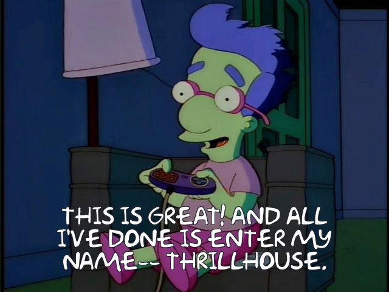

# Frinkit
A tiny [Frinkiac][1] & [Morbotron][2] client, written in Swift 3.

[](https://github.com/KevinVitale/ReactiveJSON/releases/latest)


## Installation

`Frinkiac` supports _Carthage_; add the following to your `Cartfile`:

```ruby
github "KevinVitale/Frinkiac"
```

## Overview

The included [Xcode workspace](Frinkiac.xcworkspace) provides three targets:

- `Frinkiac`: _the client library providing [Frinkiac][1] and [Morbotron][2] API capabilities_;
- `Frinkiac-macOS`: _an example macOS application which can search for and share memes_;
- `MessengesExtension`: _an iMessage application which can search for and share memes_.

> _Learn who is behind [frinkiac.com][1], what it **is**, and how it works [here](https://langui.sh/2016/02/02/frinkiac-the-simpsons-screenshot-search-engine/)._

### Framework

The `Frinkiac` framework allows you to:

-  **search** for _frames_ of episodes containing certain phrases;
- extract **captions**, which represent the exact phrases spoken within a _frame_;
- generate **random** _captions_.

#### Searching

You can search for frames that contain the phrase you're looking for. [`FrameSearchProvider`](Frinkiac/FrameSearchProvider.swift) makes searching easy:

```swift
import Frinkiac

// Creates a "Simpsons" search provider.
let searchProvider = FrameSearchProvider<Frinkiac> { frameImages in
  /* Do something with `frameImages` */
}

// Search for memes containing your favorite quote!
searchProvider.find("All this computer hacking is making me thirsty")
```

#### Extract Captions

Searching for phrases returns a collection of [`FrameImage<M>`](Frinkiac/FrameImage.swift), where `M` represents an instance of the [`MemeGenerator`](Frinkiac/MemeGenerator.swift) protocol.

>  **Note**: _two concrete `MemeGenerator` implementations are provided for you — [`Frinkiac`](Frinkiac/Frinkiac.swift), and [`Morbotron`](Frinkiac/Morbotron.swift)_.

A `FrameImage` manages a [`Frame`](Frinkiac/JSONResponses.swift), and the _image data_ associated with it.



A `FrameImage` is created <u>without</u> its _caption_ or its _image data_ having been downloaded — the exception to this being when generating a **random** _caption_.

Upon receiving a `FrameImage`, update its `caption` by calling `caption(_:)` — this will implicitly download (and assign) the value for `.image`:

```swift
// As part of `FrameSearchProvider` initialization...
FrameSearchProvider<Frinkiac> { frameImages in
  let frameImage = frameImages.first
  
  // Updates `caption` (and downloads image data) by
  // invoking the `closure` being passed back.
  frameImage.caption { closure in
  	let image = try? closure().image
  	Dispatch.main.async {
      /* Do something with `image` in the UI */
  	}
  }
}
```

If you want the result of `.image` to display text different than what was actually said (or some variation therein), call `update(_:_:)`:

```swift
// As part of `FrameSearchProvider` initialization...
FrameSearchProvider<Frinkiac> { frameImages in
  let frameImage = frameImages.first
  
  // Apply `text` (and downloads image data) by
  // invoking the `closure` being passed back.
  frameImage.update("Do the Bartman!") { closure in
  	let image = try? closure()
  	Dispatch.main.async {
      /* Do something with `image` in the UI */
  	}
  }
}
```

#### Random

The easiest way to generate random captions is to use `FrameSearchProvider<M>.random(_:)`. 

> **Note**: _The `FrameImage` returned will have a non-nil `.caption` value, and its `.image` will have been downloaded_.

```swift
import Frinkiac

// Creates a "Simpsons" search provider.
let searchProvider = FrameSearchProvider<Frinkiac> { _ in
  /* Calling `random` does *not* invoke the search callback */
}

searchProvider.random {
  let frameImage = try? $0()
  /* Do something with `frameImage` */
}
```

### Playground

The workspace file also includes a playground which demostrates `FrameSearchController`.


## Frinkiac-macOS

The project includes a macOS application, as well.


[1]: http://frinkiac.com	"Frinkiac"
[2]: http://morbotron.com	"Morbotron"
