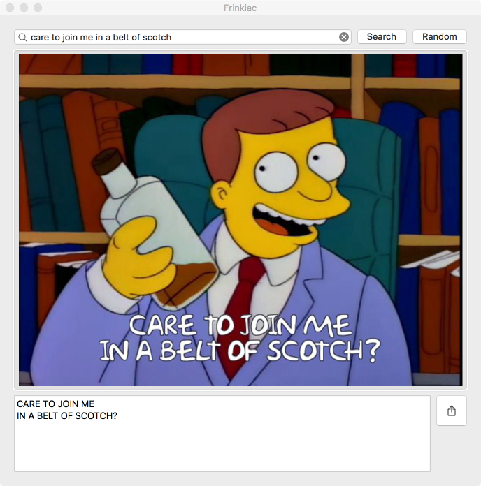

# Frinkiac
A tiny [Frinkiac][1] & [Morbotron][2] client, written in Swift 3.

[](https://github.com/KevinVitale/ReactiveJSON/releases/latest)


## Installation

`Frinkiac` supports _Carthage_; add the following to your `Cartfile`:

```ruby
github "KevinVitale/Frinkiac"
```

## Frinkiac

This is a passion project that merges two things I :heart: very much: [Frinkiac][1] & Swift.

> _Learn who is behind [frinkiac.com][1], what it **is**, and how it works [here](https://langui.sh/2016/02/02/frinkiac-the-simpsons-screenshot-search-engine/)._

## iOS

#### FrameSearchController

The [`FrameSearchController`](Frinkiac/FrameSearchController.swift) is a `UIViewController` subclass that let's your search for quotes, and displays a grid of results.


#### Playground

The included playground demonstrates how simple it is to use the `Frinkiac` framework.

```swift
import Frinkiac
import PlaygroundSupport

public typealias MemeService = Morbotron
public let searchController = FrameSearchController<MemeService>()

PlaygroundPage.current.needsIndefiniteExecution = true
PlaygroundPage.current.liveView = searchController
```


#### iMessage App

The included **MessageExtension** target is an included iMessage app that demonstrates how `Frinkiac` can be used to build just such a thing.


## macOS

`Frinkiac` doesn't provide a `FrameSearchController` macOS-equivalent (_yet_); however, the included **Frinkiac-macOS** app gives [a good demonstration](./FrinkiacApp/Frinkiac-macOS/AppDelegate.swift) of what can be done with `Frinkiac` directly.



[1]: http://frinkiac.com	"Frinkiac"
[2]: http://morbotron.com	"Morbotron"
